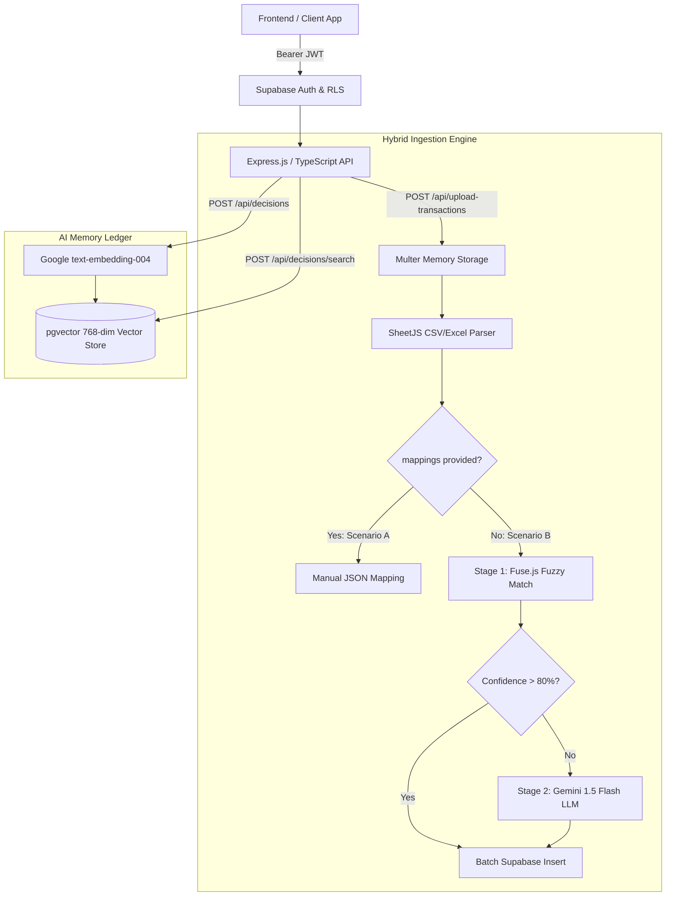

# AARYA — Autonomous AI for Runway, Yield & Analytics 🚀

<div align="center">

**India-First AI CFO Copilot for SMEs and Startups**

[](https://www.typescriptlang.org/)
[](https://nodejs.org/)
[](https://expressjs.com/)
[](https://supabase.com/)
[](https://www.postgresql.org/)
[](https://ai.google.dev/)
[](https://github.com/pgvector/pgvector)

---

*Turning messy financial spreadsheets, scattered invoices, and bank statements into clear, plain-English answers about cash flow, runway, dues, and business health.*

</div>

---

## 📖 1. Executive Summary & Problem Statement

Indian SMEs and startups often manage finance through disconnected spreadsheets, scattered invoices, bank statements, and manual follow-ups. Founders struggle to get quick, reliable answers to practical operational questions like:
* *"How many months of cash runway do we have left at our current burn rate?"*
* *"Which customers owe us money, and what are our immediate payables?"*
* *"Can we afford to hire two new engineers next month?"*

While the financial data exists, **decision-ready insight does not**. Traditional accounting software merely records transactions, and static dashboards display numbers without context. Hiring full-time CFOs or virtual CFO services is expensive and human-dependent.

### 🌟 The India-First Positioning
AARYA is built specifically for how Indian businesses actually operate. It understands the nuances of **GST, TDS, UPI payments, bank transfers**, and local accounting practices. AARYA acts as a **financial decision engine**, bridging the gap between raw ledger data and executive decision-making — making CFO-level insights **faster, cheaper, and always available**.

---

## 🏗️ 2. Backend Architecture & Key Innovations

This repository houses the enterprise-grade backend API built for AARYA. Designed for multi-tenancy, high security, and AI-native data processing, the architecture features four core pillars:



### 🔒 1. Multi-Tenant PostgreSQL with Strict RLS
* Every tenant (company) is completely isolated at the database level.
* **Row Level Security (RLS)** is enforced on all tables (`companies`, `users`, `financial_transactions`, `financial_state_snapshots`, and `decision_memory_logs`).
* Database queries automatically bind to `auth.uid()` via custom PostgreSQL helper functions (`get_my_company_id()`), guaranteeing zero data leakage across companies.

### ⚡ 2. Hybrid Data Ingestion Service (`POST /api/upload-transactions`)
SMEs upload raw CSV or Excel files with varying column header formats. Our hybrid ingestion pipeline normalizes them effortlessly:
* **Scenario A (Manual Mapping)**: The request payload includes explicit JSON column mappings from the client.
* **Scenario B (Two-Stage Auto-Detection Fallback)**:
  * **Stage 1 (Zero-Cost Fuzzy Matching)**: Uses `Fuse.js` to evaluate uploaded headers against a dictionary of known financial synonyms (e.g., matching `"total_spend"`, `"dr"`, or `"outgoing"` to `amount`).
  * **Stage 2 (LLM Fallback via Google Gemini)**: If required fields (`amount`, `transaction_type`, `due_date`) remain unmatched or fall below the confidence threshold, the backend samples the first 5 rows and invokes **Google Gemini 1.5 Flash** in structured JSON mode to dynamically classify and map the columns.

### 🧠 3. AI Decision Memory Ledger (`pgvector` + Google Gemini)
AARYA does not just answer questions; it remembers context and learns from founder actions:
* Logs financial context, AI recommendations, and actual founder decisions.
* Uses Google's **`text-embedding-004`** model to generate 768-dimensional semantic embeddings.
* Leverages PostgreSQL's **`pgvector`** extension with IVFFlat indexing to perform real-time **cosine similarity searches** — retrieving historical precedents when founders face similar financial dilemmas.

---

## 🛠️ 3. Technology Stack

| Component | Technology | Purpose |
| :--- | :--- | :--- |
| **Runtime & Language** | [Node.js](https://nodejs.org/) & [TypeScript](https://www.typescriptlang.org/) | Strict type safety, ES2022 modern syntax, high-performance async I/O |
| **Web Framework** | [Express.js](https://expressjs.com/) | REST API routing, custom middleware architecture |
| **Security & Logging** | [Helmet](https://helmetjs.github.io/) & [Morgan](https://github.com/expressjs/morgan) | HTTP header hardening and automated request logging |
| **Database & Auth** | [Supabase](https://supabase.com/) (PostgreSQL 15+) | Managed Postgres, Row Level Security (RLS), Supabase Auth JWT verification |
| **AI & Vector Engine** | [Google Gemini AI](https://ai.google.dev/) & `pgvector` | `gemini-1.5-flash` for schema mapping; `text-embedding-004` for 768-dim vector embeddings |
| **File Processing** | [SheetJS (`xlsx`)](https://sheetjs.com/) & [Multer](https://github.com/expressjs/multer) | In-memory buffer parsing for CSV, XLS, and XLSX spreadsheets |
| **Validation & Matching**| [Zod](https://zod.dev/) & [Fuse.js](https://www.fusejs.io/) | Runtime request schema validation and approximate string matching |

---

## 🚀 4. Step-by-Step Setup Guide

Follow these instructions to set up the database and run the backend server locally within minutes.

### Prerequisites
* **Node.js**: `v18.0.0` or higher ([Download Node.js](https://nodejs.org/))
* **Supabase Account**: Free tier works perfectly ([Sign up at Supabase](https://supabase.com/))
* **Google Gemini API Key**: Free tier available ([Get key at Google AI Studio](https://aistudio.google.com/app/apikey))

---

### Step 1: Clone the Repository & Install Dependencies

```bash
# Clone the repository and checkout the backend branch
git clone -b backend https://github.com/DineshAK-coder/AARYA.git
cd AARYA/AARYA/aarya-backend

# Install npm dependencies
npm install
```

---

### Step 2: Supabase Database Setup

1. **Create a New Project**: In your Supabase dashboard, click **New Project**, select a region, set a secure database password, and wait ~2 minutes for provisioning.
2. **Enable pgvector**:
   * In the left sidebar, navigate to **Database → Extensions**.
   * Search for `vector` and toggle it **ON**.
3. **Run the SQL Migration**:
   * In the left sidebar, go to **SQL Editor** and click **New query**.
   * Open the file located at [`migrations/001_initial_schema.sql`](./migrations/001_initial_schema.sql) in this repository.
   * Copy and paste the entire SQL contents into the query editor and click **Run** (▶).
   * *Verification*: Go to **Authentication → Policies** in your Supabase dashboard. You should see active Row Level Security policies across `companies`, `users`, `financial_transactions`, `financial_state_snapshots`, and `decision_memory_logs`.

---

### Step 3: Configure Environment Variables

Create a copy of `.env.example` named `.env` in the root of `AARYA/aarya-backend/`:

```bash
cp .env.example .env
```

Open `.env` and fill in your credentials:

```env
# ---- Supabase Credentials (From: Project Settings -> API) ----
SUPABASE_URL=https://your-project-ref.supabase.co
SUPABASE_ANON_KEY=eyJhbGciOiJIUzI1NiIsIn...
SUPABASE_SERVICE_ROLE_KEY=eyJhbGciOiJIUzI1NiIsIn... # WARNING: Keep secret! Bypasses RLS.

# ---- Google Gemini AI (From: https://aistudio.google.com/app/apikey) ----
GEMINI_API_KEY=AIzaSy...

# ---- Server Configuration ----
PORT=3001
NODE_ENV=development
MAX_FILE_SIZE_MB=10
```

---

### Step 4: Start the Development Server

```bash
# Start the server in watch mode (auto-reloads on file edits)
npm run dev
```

You should see the following console output:
```text
🚀 AARYA Backend running on http://localhost:3001
   Environment : development
   Health check: http://localhost:3001/health
```

---

## 📡 5. Comprehensive API Reference & cURL Examples

All protected routes require a Supabase Auth JWT in the header:
`Authorization: Bearer <your_access_token>`

### 🌐 System & Auth Endpoints

| Method | Endpoint | Description | Auth Required? |
| :---: | :--- | :--- | :---: |
| `GET` | `/health` | Server health check and uptime status | ❌ No |
| `GET` | `/api/auth/me` | Get current authenticated user profile & company details | ✅ Yes |

#### Example: Check Health
```bash
curl http://localhost:3001/health
```

---

### 🏢 Company & Onboarding Endpoints

| Method | Endpoint | Description | Auth Required? | Role Required |
| :---: | :--- | :--- | :---: | :---: |
| `POST` | `/api/companies/onboard` | Create a new company tenant (for newly registered founders) | ✅ Yes (JWT) | Any |
| `GET` | `/api/companies/me` | Retrieve current company profile & billing tier | ✅ Yes | Any |
| `PATCH` | `/api/companies/me` | Update company name or subscription status | ✅ Yes | `owner` |
| `GET` | `/api/companies/members` | List all team members belonging to the company | ✅ Yes | Any |
| `POST` | `/api/companies/invite` | Send magic-link email invitation to join the team | ✅ Yes | `owner` / `admin` |

#### Example: Onboard New Company
```bash
curl -X POST http://localhost:3001/api/companies/onboard \
  -H "Authorization: Bearer <your_token>" \
  -H "Content-Type: application/json" \
  -d '{"name": "Acme Innovations Pvt Ltd"}'
```

---

### 📊 Financial Transactions & Hybrid Ingestion

| Method | Endpoint | Description | Auth Required? |
| :---: | :--- | :--- | :---: |
| `POST` | `/api/upload-transactions` | **Hybrid Ingestion**: Upload CSV/Excel spreadsheets with optional mappings | ✅ Yes |
| `GET` | `/api/transactions` | List ledger transactions with pagination, date, and type filters | ✅ Yes |

#### Scenario A: Upload CSV with Manual Column Mapping
```bash
curl -X POST http://localhost:3001/api/upload-transactions \
  -H "Authorization: Bearer <your_token>" \
  -F "file=@/path/to/bank_statement.csv" \
  -F 'column_mappings={"amount":"Total Spent","transaction_type":"Tx Type","due_date":"Date","description":"Memo"}'
```

#### Scenario B: Upload Excel Spreadsheet (Auto-Detection via Gemini / Fuse.js)
```bash
curl -X POST http://localhost:3001/api/upload-transactions \
  -H "Authorization: Bearer <your_token>" \
  -F "file=@/path/to/messy_accounts.xlsx"
```
*Server Response (Example)*:
```json
{
  "success": true,
  "data": {
    "inserted": 142,
    "errors": [],
    "mapping_source": "llm",
    "detected_mappings": {
      "amount": "Value (INR)",
      "transaction_type": "Flow Category",
      "due_date": "Posting Date",
      "description": "Narrative"
    }
  }
}
```

---

### 📈 Financial Health Snapshots

| Method | Endpoint | Description | Auth Required? | Role Required |
| :---: | :--- | :--- | :---: | :---: |
| `GET` | `/api/snapshots` | Retrieve periodic financial health summaries (paginated) | ✅ Yes | Any |
| `POST` | `/api/snapshots` | Generate and save a new AI health snapshot (runway, net cash flow) | ✅ Yes | `owner` / `admin` |

#### Example: Create Health Snapshot
```bash
curl -X POST http://localhost:3001/api/snapshots \
  -H "Authorization: Bearer <your_token>" \
  -H "Content-Type: application/json" \
  -d '{"runway_months": 14.5, "net_cash_flow": 250000.00, "snapshot_date": "2026-07-01"}'
```

---

### 🧠 AI Decision Memory Ledger (`pgvector`)

| Method | Endpoint | Description | Auth Required? |
| :---: | :--- | :--- | :---: |
| `GET` | `/api/decisions` | List historical AI decision logs | ✅ Yes |
| `POST` | `/api/decisions` | Store financial context & recommendation + generate 768-dim vector embedding | ✅ Yes |
| `POST` | `/api/decisions/search` | **Semantic Search**: Find relevant historical decisions using cosine similarity | ✅ Yes |
| `PATCH` | `/api/decisions/:id` | Log the actual decision taken by the founder (for outcome tracking) | ✅ Yes |

#### Example: Semantic Decision Search
```bash
curl -X POST http://localhost:3001/api/decisions/search \
  -H "Authorization: Bearer <your_token>" \
  -H "Content-Type: application/json" \
  -d '{"query": "Should we extend vendor payment cycles to preserve cash?", "threshold": 0.4, "limit": 5}'
```

---

## 🔮 6. Future Roadmap (Post-Hackathon Vision)

As AARYA evolves from a 36-hour hackathon MVP into a full-scale SaaS financial operating system, our development roadmap includes:

- [ ] **Native Indian Accounting Integrations**: Direct sync with **Tally Prime**, **Zoho Books**, and **QuickBooks India**.
- [ ] **Automated Bank & UPI Reconciliation**: Direct bank statement parsing, UPI reference matching, and payment gateway (Razorpay / Cashfree) fee reconciliation.
- [ ] **Compliance & Tax Reminders**: Automated alerts and runway adjustments for upcoming **GST (GSTR-1, GSTR-3B)**, **TDS**, and advance tax filing deadlines.
- [ ] **Automated Collection Nudges**: Smart, AI-drafted payment reminders sent via **WhatsApp** and email for overdue accounts receivable.
- [ ] **Scenario Planning & Board Decks**: Interactive sensitivity analysis (*"What if churn increases by 2%?"*) and one-click PDF generation for investor updates and board presentations.
- [ ] **Multi-Client Portal for CAs**: Dedicated dashboard view allowing Chartered Accountants and fractional CFOs to manage dozens of SME clients seamlessly from a single login.

---

## 👥 7. Contributing & License

Built with ❤️ for Indian founders and SMEs. This project is open-sourced under the MIT License.

1. Fork the repository
2. Create your feature branch (`git checkout -b feature/amazing-feature`)
3. Commit your changes (`git commit -m 'feat: add amazing feature'`)
4. Push to the branch (`git push origin feature/amazing-feature`)
5. Open a Pull Request

---
<div align="center">
<b>AARYA</b> — The Finance Brain for India's Next Generation of Entrepreneurs.
</div>
