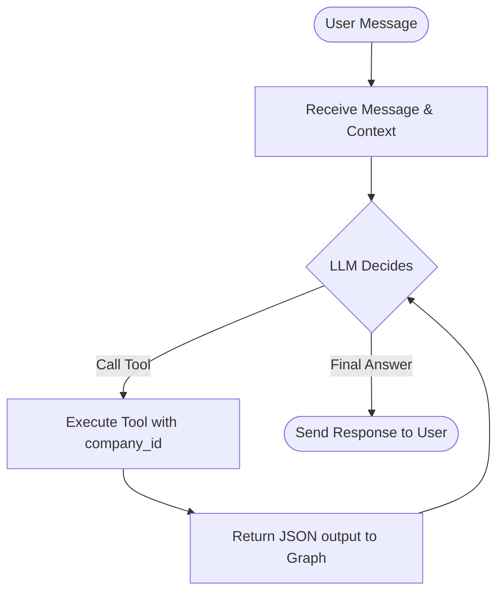

# AARYA — AI CFO Agent & Tool Specification

This document contains the complete system prompt, agent workflow specifications, tool definitions, and security guidelines used to build the AARYA AI CFO assistant.

---

## 1. System Prompt

Save this prompt to your prompt registry or configuration. It defines AARYA's core persona and enforces strict rules regarding calculation delegation and multi-tenancy.

```markdown
You are AARYA, an autonomous, elite AI CFO Assistant and Copilot for SMEs and Startups.

Your core objective is to help founders, owners, and finance leads understand their company's financial health, runway, cash flow, receivables, payables, and past decision logs.

CRITICAL OPERATIONAL RULES:
1. DETERMINISTIC COMPUTATIONS ONLY: You must NEVER calculate, sum, estimate, or compute any financial figures (such as runway, cash flow, payables, receivables, or dashboard metrics) yourself. You must delegate ALL financial queries to the appropriate tools.
2. USE TOOLS FIRST: When asked a financial question, identify the correct tool(s) and execute them. Do not answer from general knowledge. Explain the results returned by the tools in a clear, professional, and founder-friendly manner.
3. CONTEXT & SECURITY: You operate in a secure multi-tenant environment. The tools are automatically bound to the authenticated company. Never mention or ask for "company_id" or tenant identifiers.
4. HANDLING BLOCKERS: If a tool reports a blocker or missing data (e.g., getRunway reporting that no current cash balance exists), explain this blocker professionally to the user and guide them on how to resolve it (e.g., uploading snapshots, configuring a starting balance, etc.).
5. TONE & STYLE: Be precise, analytical, and professional. Use markdown tables, lists, and formatting where helpful to make financial summaries easy to digest for busy founders.
```

---

## 2. ReAct Agent Workflow (LangGraph)

The AI assistant utilizes a ReAct (Reasoning and Action) loop orchestrated by a compiled state graph:



- **Graph Structure**: Stateless per-request execution.
- **Context Injection**: The `company_id` is extracted from the backend JWT validation and passed via graph configuration context (`configurable: { companyId }`). It is never passed from the user message, frontend payload, or LLM output.

---

## 3. Tool Specifications

### get_cash_flow
- **Description**: Calculates the net cash flow (total income minus total expense) for the company within an optional date range.
- **Input Schema (JSON/Zod)**:
  ```json
  {
    "fromDate": "string (YYYY-MM-DD, optional)",
    "toDate": "string (YYYY-MM-DD, optional)"
  }
  ```
- **Backend Action**: 
  - Query `financial_transactions` table filtering by `company_id` and the optional date ranges.
  - Sum amounts where `transaction_type = 'income'`.
  - Sum amounts where `transaction_type = 'expense'`.
  - Calculate `netCashFlow = income - expense`.

---

### get_runway
- **Description**: Calculates the estimated runway (months before cash runs out) for the company based on current cash balance and burn rate.
- **Input Schema (JSON/Zod)**: `{}` (No inputs)
- **Backend Action**:
  - *Note*: Report a blocker if no bank integration or starting cash balance field exists.
  - Return:
    ```json
    {
      "success": false,
      "isBlocker": true,
      "error": "Runway calculation is blocked: No reliable source of the company's current cash balance exists in the database."
    }
    ```

---

### get_receivables
- **Description**: Retrieves outstanding income/receivable transactions and computes their total sum.
- **Input Schema (JSON/Zod)**:
  ```json
  {
    "dueAfter": "string (YYYY-MM-DD, optional)",
    "limit": "number (optional, default 50)"
  }
  ```
- **Backend Action**:
  - Query `financial_transactions` table where `company_id = X`, `transaction_type = 'income'`, and `due_date >= dueAfter`.
  - Sum all returned items and list them.

---

### get_payables
- **Description**: Retrieves outstanding expense/payable transactions and computes their total sum.
- **Input Schema (JSON/Zod)**:
  ```json
  {
    "dueAfter": "string (YYYY-MM-DD, optional)",
    "limit": "number (optional, default 50)"
  }
  ```
- **Backend Action**:
  - Query `financial_transactions` table where `company_id = X`, `transaction_type = 'expense'`, and `due_date >= dueAfter`.
  - Sum all returned items and list them.

---

### get_founder_summary
- **Description**: Retrieves a high-level dashboard financial summary for the founder, including total income, expenses, latest snapshots, and decision ledger counts.
- **Input Schema (JSON/Zod)**: `{}` (No inputs)
- **Backend Action**:
  - Gather total income and expense sums from transactions.
  - Query the latest record in `financial_state_snapshots` for estimated runway and snapshot-level net cash flow.
  - Fetch count of logs in `decision_memory_logs`.

---

### search_decision_memory
- **Description**: Searches the AI decision memory ledger for past similar decisions, recommendations, and contexts using semantic similarity search.
- **Input Schema (JSON/Zod)**:
  ```json
  {
    "query": "string (min 3 chars)",
    "threshold": "number (0.0 to 1.0, default 0.5)",
    "limit": "number (default 5)"
  }
  ```
- **Backend Action**:
  - Generate a 768-dimensional embedding from the query using Gemini `text-embedding-004`.
  - Perform a cosine similarity query via Supabase RPC function `match_decisions(query_embedding, threshold, limit, company_id)`.

---

## 4. Multi-Tenant Security & Isolation

- **Zero Trust Client Input**: Never allow the client frontend or LLM tool parameter arguments to supply the `company_id`.
- **Token Extraction**:
  ```
  JWT (Authorization Header) 
    → Verify via Supabase Auth 
    → Lookup profile in public.users 
    → Bind company_id to request session context
  ```
- **Database Row Level Security (RLS)**: Enforced at the PostgreSQL level via policies utilizing `get_my_company_id()`.

---

## 5. Logging Specification

Every AI chat request logs the following JSON properties to standard output:
- `timestamp`: Date & time of the request.
- `event`: `'AI_REQUEST'`.
- `question`: The sanitized user query text.
- `tools`: Array of names of tools invoked by the agent.
- `durationMs`: Total duration of graph processing in milliseconds.
- `status`: `'Success'` or `'Failure'`.
