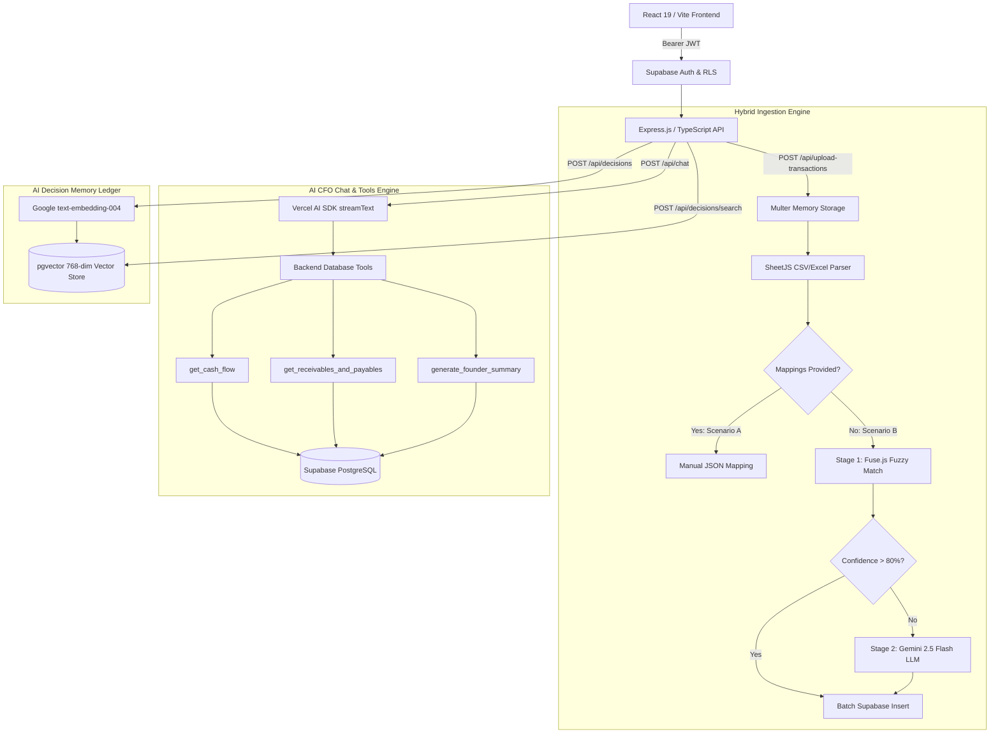

# AARYA — Autonomous AI for Runway, Yield & Analytics 🚀

<div align="center">

**India-First AI CFO Copilot for SMEs and Startups**

[](https://www.typescriptlang.org/)
[](https://react.dev/)
[](https://nodejs.org/)
[](https://expressjs.com/)
[](https://supabase.com/)
[](https://www.postgresql.org/)
[](https://ai.google.dev/)
[](https://github.com/pgvector/pgvector)
[](https://vite.dev/)
[](https://tailwindcss.com/)

---

> *"AARYA is an India-first AI CFO copilot for SMEs and startups that turns raw finance data into runway, yield, cash-flow, and decision insights in plain English."*

</div>

---

## 📖 1. Executive Summary

AARYA is an India-first AI CFO copilot designed for SMEs, startups, finance teams, and Chartered Accountants (CAs). It transforms messy financial data—such as spreadsheets, bank exports, and scattered invoices—into simple, actionable answers about cash flow, runway, dues, and overall business health. 

Built to begin as a high-impact 36-hour hackathon MVP, AARYA is architected from day one to scale into an enterprise-grade SaaS financial operating system.

---

## 🚨 2. Problem Statement & Why It Matters

### The Problem
Indian SMEs and startups often manage their finance through disconnected spreadsheets, scattered PDF invoices, bank statements, and manual follow-ups. Founders do not get immediate answers to practical, mission-critical questions such as:
* *"How many months of cash runway do we have left at our current burn rate?"*
* *"Which clients owe us money, and what are our immediate vendor payables?"*
* *"Can we safely afford to hire two new engineers next month?"*

While transaction data exists in abundance, **decision-ready operational insight does not**. Traditional accounting software merely records historical transactions, while generic dashboards display static numbers without executive context. Hiring full-time CFOs or human-led virtual CFO services remains expensive, slow, and dependent on manual interpretation.

### Why This Problem Matters in India
The Indian market exhibits strong willingness to pay for virtual CFO services, finance automation, and real-time cash visibility tools. The operational pain is particularly acute in India because businesses operate within unique regulatory and financial workflows—relying heavily on **GST (Goods & Services Tax)**, **TDS (Tax Deducted at Source)**, **UPI payments**, **bank transfers**, and legacy accounting software that require human interpretation. This makes finance automation one of the strongest and most resilient SaaS wedges for an India-first startup.

---

## 🎯 3. Target Audience & Positioning

### Primary Users
* **Startup Founders & Co-founders**: Seeking immediate runway calculations, burn rate analysis, and hiring feasibility without waiting for month-end accounting reports.
* **SME Business Owners**: Wanting real-time cash visibility, vendor payable tracking, and customer due collections.

### Secondary Users
* **Finance Managers & Internal Accountants**: Looking to automate ledger ingestion and reporting workflows.
* **Chartered Accountants (CAs) & Fractional CFOs**: Managing multiple client portfolios and requiring an automated financial decision engine.

### Ideal First Customer
A growing Indian small business or seed-stage startup that already generates regular transaction data (CSV/Excel bank exports or invoice ledgers) but currently lacks real-time financial visibility and strategic cash forecasting.

---

## 💡 4. Product Vision & Differentiation

AARYA is designed to feel like an **intelligent financial decision engine**, not just a generic chatbot. The long-term vision is to become the **finance command center** that ingests business data, interprets financial health in plain English, and proactively recommends growth and survival actions.

| Feature | Generic Accounting Software | Generic AI Chatbots | **AARYA (AI CFO Copilot)** |
| :--- | :--- | :--- | :--- |
| **Data Handling** | Records raw transactions | Hallucinates without context | **Interprets ledgers via hybrid AI schema mapping** |
| **Dashboards** | Displays static numbers | No graphical dashboards | **Interactive charts with CFO context & warnings** |
| **Explainability** | Manual formula auditing | Black-box LLM text | **Full mathematical explainability & transaction citations** |
| **Availability** | Requires human operator | General purpose | **Faster, cheaper, 24/7 specialized India-first finance brain** |
| **Local Context** | Global generic formats | Lacks regional nuances | **Built for Indian workflows (GST, TDS, UPI, INR formatting)** |

---

## ⚡ 5. Core MVP Scope (36-Hour Hackathon Build)

The hackathon MVP is small, highly visible, and demo-ready—proving that AARYA can turn raw financial spreadsheets into decision-support insights within minutes.

### 🌟 Non-Negotiable MVP Features & Screens
1. **🔐 Login / Project Landing Page**: Sleek onboarding workflow where founders register their company, set primary currencies (INR ₹ default), and tag industry categories.
2. **📤 Hybrid Data Upload Screen (`/api/upload-transactions`)**: Multi-format CSV and Excel spreadsheet uploader equipped with zero-cost fuzzy matching (`Fuse.js`) and **Google Gemini 2.5 Flash** automated column classification.
3. **📊 Executive Finance Dashboard**: A clean, glassmorphic dashboard showcasing real-time indicators:
   * **Net Cash Flow & Liquidity**: Total cash inflows vs. operating expenses.
   * **Runway Months**: Automatically derived from expense date spans and net liquidity.
   * **Receivables & Payables Snapshot**: Total outstanding dues and urgent overdue vendor bills.
4. **💬 Interactive AI CFO Chat Section**: A plain-English question-answer copilot powered by live backend database tools (`get_cash_flow`, `get_receivables_and_payables`, `generate_founder_summary`). Features full mathematical explainability, transaction citations, voice input, and error recovery reset controls.
5. **📑 Founder Summary & Insights Report**: Automated intelligence brief highlighting **What is Good** (surpluses, growth), **What is Risky** (overdue payables, high burn), and **What Needs Attention**, paired with actionable strategic recommendations.

---

## 🏗️ 6. System Architecture & Data Flow

AARYA operates as a decoupled full-stack application leveraging strict multi-tenancy, AI vector embeddings, and real-time database tools:



### Key Architectural Innovations
* **Multi-Tenant PostgreSQL with Strict RLS**: Every company is isolated at the database level using Supabase Row Level Security (RLS). All queries automatically bind to `auth.uid()` via custom helper functions (`get_my_company_id()`), guaranteeing zero cross-company data leakage.
* **Hybrid Data Ingestion Service**: When messy accounting exports are uploaded without column mappings, AARYA attempts zero-cost fuzzy matching (`Fuse.js`) against known financial synonyms. If confidence is low, it samples 5 rows and invokes **Google Gemini 2.5 Flash** in structured JSON mode to dynamically classify headers into our canonical schema (`amount`, `transaction_type`, `due_date`, `description`).
* **Tool-First AI Math Explainability**: To eliminate LLM hallucination in financial calculations, AARYA's chat controller enforces backend tool execution. The tools return exact mathematical formulas (`calculation_explanation`) and top supporting transaction records (`supporting_transactions`), giving founders complete transparency into how numbers were derived.
* **Semantic AI Decision Memory (`pgvector`)**: AARYA remembers context and learns from founder actions. It logs financial dilemmas, generates 768-dimensional embeddings using Google's `text-embedding-004`, and uses IVFFlat indexing in PostgreSQL to perform cosine similarity searches—retrieving historical precedents when founders face similar strategic decisions.

---

## 🛠️ 7. Technology Stack

| Layer | Technology | Purpose |
| :--- | :--- | :--- |
| **Frontend Framework** | [React 19](https://react.dev/) & [Vite 6](https://vite.dev/) | High-performance single-page application with modern component architecture |
| **Styling & UI** | [Tailwind CSS v4](https://tailwindcss.com/) & [Lucide React](https://lucide.dev/) | Responsive glassmorphic UI, dynamic animations, and curated financial iconography |
| **Data Visualization** | [Recharts](https://recharts.org/) & [Motion](https://motion.dev/) | Interactive financial charts, runway projections, and smooth micro-animations |
| **Backend API** | [Node.js](https://nodejs.org/) & [Express.js](https://expressjs.com/) | Robust REST API routing, custom middleware, and strict TypeScript compilation |
| **Database & Auth** | [Supabase](https://supabase.com/) (PostgreSQL 15+) | Managed Postgres, strict Row Level Security (RLS), and JWT authentication |
| **AI & Vector Engine** | [Google Gemini AI](https://ai.google.dev/) & `pgvector` | `gemini-2.5-flash` for chat & mapping; `text-embedding-004` for 768-dim vector embeddings |
| **AI SDK** | [Vercel AI SDK](https://sdk.vercel.ai/) | `@ai-sdk/react` (`useChat`), `@ai-sdk/google`, and server-side tool orchestration |
| **File Processing** | [SheetJS (`xlsx`)](https://sheetjs.com/) & [Multer](https://github.com/expressjs/multer) | In-memory buffer parsing for CSV, XLS, and XLSX accounting spreadsheets |

---

## 🚀 8. Step-by-Step Setup & Full-Stack Launcher

You can launch both the backend API and frontend application simultaneously on Windows using our automated boot script, or set them up manually.

### Prerequisites
* **Node.js**: `v18.0.0` or higher ([Download Node.js](https://nodejs.org/))
* **Supabase Account**: Free tier works perfectly ([Sign up at Supabase](https://supabase.com/))
* **Google Gemini API Key**: Free tier available ([Get key at Google AI Studio](https://aistudio.google.com/app/apikey))

---

### Step 1: Clone the Repository & Install Dependencies

```bash
# Clone the project repository
git clone https://github.com/DineshAK-coder/AARYA.git
cd AARYA

# Install backend dependencies
cd BACKEND/aarya-backend
npm install

# Install frontend dependencies
cd ../../FRONTEND
npm install
cd ..
```

---

### Step 2: Supabase Database Setup

1. **Create a New Project**: In your Supabase dashboard, click **New Project**, select a region, set a database password, and wait ~2 minutes for provisioning.
2. **Enable pgvector**:
   * Navigate to **Database → Extensions** in the left sidebar.
   * Search for `vector` and toggle it **ON**.
3. **Run the SQL Migration**:
   * Go to **SQL Editor** and click **New query**.
   * Open [`BACKEND/aarya-backend/migrations/001_initial_schema.sql`](file:///c:/takeover%20hackathon%20integration/AARYA/BACKEND/aarya-backend/migrations/001_initial_schema.sql), copy the entire SQL contents, paste into the query editor, and click **Run** (▶).
   * *Verification*: Navigate to **Authentication → Policies** to confirm active RLS policies on `companies`, `users`, `financial_transactions`, `financial_state_snapshots`, and `decision_memory_logs`.

---

### Step 3: Configure Environment Variables

#### Backend Environment (`BACKEND/aarya-backend/.env`)
Copy `.env.example` to `.env` inside `BACKEND/aarya-backend/`:
```env
# Supabase Credentials (Project Settings -> API)
SUPABASE_URL=https://your-project-ref.supabase.co
SUPABASE_ANON_KEY=eyJhbGciOiJIUzI1NiIsIn...
SUPABASE_SERVICE_ROLE_KEY=eyJhbGciOiJIUzI1NiIsIn... # Server-side only! Bypasses RLS.

# Google Gemini AI (https://aistudio.google.com/app/apikey)
GEMINI_API_KEY=AIzaSy...

# Server Configuration
PORT=3001
NODE_ENV=development
MAX_FILE_SIZE_MB=10
```

#### Frontend Environment (`FRONTEND/.env`)
Copy `.env.example` to `.env` inside `FRONTEND/`:
```env
GEMINI_API_KEY=AIzaSy...
APP_URL=http://localhost:5173
```

---

### Step 4: Launch Full-Stack Application (Automated)

From the root directory of the repository, run the Windows PowerShell boot script:

```powershell
.\start.ps1
```

This will automatically launch:
* **Backend API Server**: Running on `http://localhost:3001` (with watch mode hot-reloading).
* **Frontend Web App**: Running on `http://localhost:5173` (interactive UI).

> **Manual Start Alternative**:
> In Terminal 1: `cd BACKEND/aarya-backend && npm run dev`  
> In Terminal 2: `cd FRONTEND && npm run dev`

---

## 📡 9. Comprehensive API Reference & cURL Examples

All protected backend API endpoints require a valid Supabase Auth JWT:
`Authorization: Bearer <your_access_token>`

### 🌐 System & Auth Endpoints
| Method | Endpoint | Description | Auth Required? |
| :---: | :--- | :--- | :---: |
| `GET` | `/health` | Server health check and uptime status | ❌ No |
| `GET` | `/api/auth/me` | Get current authenticated user profile & company details | ✅ Yes |

### 🏢 Company & Onboarding Endpoints
| Method | Endpoint | Description | Auth Required? | Role Required |
| :---: | :--- | :--- | :---: | :---: |
| `POST` | `/api/companies/onboard` | Create a new company tenant (for newly registered founders) | ✅ Yes | Any |
| `GET` | `/api/companies/me` | Retrieve current company profile & billing tier | ✅ Yes | Any |
| `PATCH` | `/api/companies/me` | Update company name or subscription status | ✅ Yes | `owner` |
| `GET` | `/api/companies/members` | List all team members belonging to the company | ✅ Yes | Any |

#### Example: Onboard New Company
```bash
curl -X POST http://localhost:3001/api/companies/onboard \
  -H "Authorization: Bearer <your_token>" \
  -H "Content-Type: application/json" \
  -d '{"name": "Acme Innovations Pvt Ltd"}'
```

### 📊 Financial Transactions & Hybrid Ingestion
| Method | Endpoint | Description | Auth Required? |
| :---: | :--- | :--- | :---: |
| `POST` | `/api/upload-transactions` | **Hybrid Ingestion**: Upload CSV/Excel spreadsheets with optional mappings | ✅ Yes |
| `GET` | `/api/transactions` | List ledger transactions with pagination, date, and type filters | ✅ Yes |

#### Example: Upload Excel Spreadsheet (Auto-Detection via Gemini 2.5 Flash / Fuse.js)
```bash
curl -X POST http://localhost:3001/api/upload-transactions \
  -H "Authorization: Bearer <your_token>" \
  -F "file=@/path/to/messy_accounts.xlsx"
```
*Server Response (Example)*:
```json
{
  "success": true,
  "data": {
    "inserted": 142,
    "errors": [],
    "mapping_source": "llm",
    "detected_mappings": {
      "amount": "Value (INR)",
      "transaction_type": "Flow Category",
      "due_date": "Posting Date",
      "description": "Narrative"
    }
  }
}
```

### 💬 AI CFO Chat & Tools Orchestration
| Method | Endpoint | Description | Auth Required? |
| :---: | :--- | :--- | :---: |
| `POST` | `/api/chat` | Vercel AI SDK streaming endpoint executing live DB financial tools | ✅ Yes |

### 🧠 AI Decision Memory Ledger (`pgvector`)
| Method | Endpoint | Description | Auth Required? |
| :---: | :--- | :--- | :---: |
| `GET` | `/api/decisions` | List historical AI decision logs | ✅ Yes |
| `POST` | `/api/decisions` | Store financial context & recommendation + generate 768-dim vector embedding | ✅ Yes |
| `POST` | `/api/decisions/search` | **Semantic Search**: Find relevant historical decisions using cosine similarity | ✅ Yes |
| `PATCH` | `/api/decisions/:id` | Log the actual decision taken by the founder (for outcome tracking) | ✅ Yes |

#### Example: Semantic Decision Search
```bash
curl -X POST http://localhost:3001/api/decisions/search \
  -H "Authorization: Bearer <your_token>" \
  -H "Content-Type: application/json" \
  -d '{"query": "Should we extend vendor payment cycles to preserve cash?", "threshold": 0.4, "limit": 5}'
```

---

## 🔮 10. Future Roadmap (Post-Hackathon Vision)

As AARYA evolves from a 36-hour hackathon MVP into a comprehensive finance operating system, our long-term roadmap includes:

- [ ] **Native Indian Accounting Integrations**: Direct API synchronization with **Tally Prime**, **Zoho Books**, and **QuickBooks India**.
- [ ] **Automated Bank & UPI Reconciliation**: Direct bank statement parsing, UPI reference matching, and payment gateway (Razorpay / Cashfree) fee auto-reconciliation.
- [ ] **Compliance & Tax Reminders**: Automated alerts and cash runway adjustments for upcoming **GST (GSTR-1, GSTR-3B)**, **TDS**, and advance tax filing deadlines.
- [ ] **Automated Collection Nudges**: Smart, AI-drafted payment reminders sent via **WhatsApp** and email for overdue accounts receivable.
- [ ] **Scenario Planning & Board Decks**: Interactive sensitivity analysis (*"What if customer churn increases by 2%?"*) and one-click PDF generation for investor updates and board presentations.
- [ ] **Multi-Client Portal for CAs**: Dedicated dashboard view allowing Chartered Accountants and fractional CFOs to manage dozens of SME clients seamlessly from a single login.

---

## 💼 11. Business Model & Verdict

* **SaaS Subscription**: AARYA will operate on a SaaS subscription product model starting with free or low-cost pilot access during the hackathon/seed phase, later scaling to tiered pricing based on business size, user count, and advanced automation modules.
* **Final Verdict**: Built to be an indispensable **finance decision copilot** with an India-first wedge—keeping the MVP simple, visible, and immediately useful for founders.

---

## 👥 12. Contributing & License

Built with ❤️ for Indian founders and SMEs. Open-sourced under the **MIT License**.

1. Fork the repository
2. Create your feature branch (`git checkout -b feature/amazing-feature`)
3. Commit your changes (`git commit -m 'feat: add amazing feature'`)
4. Push to the branch (`git push origin feature/amazing-feature`)
5. Open a Pull Request

---

<div align="center">
<b>AARYA</b> — The Finance Brain for India's Next Generation of Entrepreneurs.
</div>
