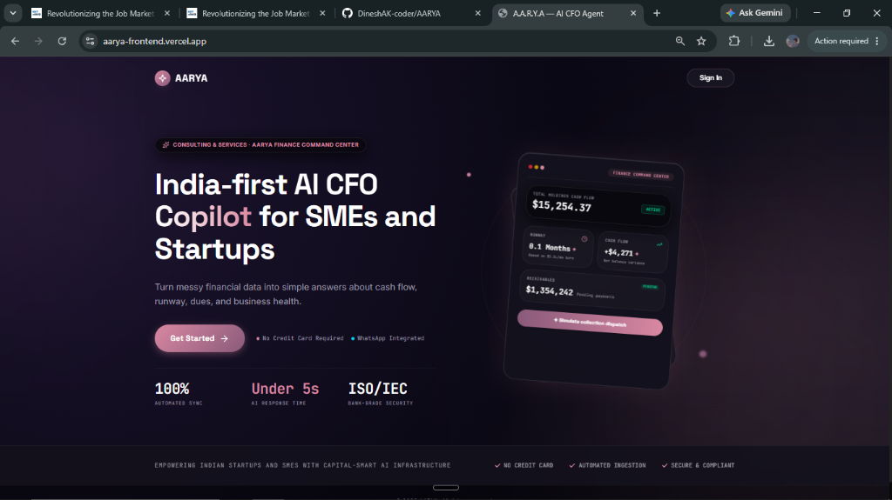
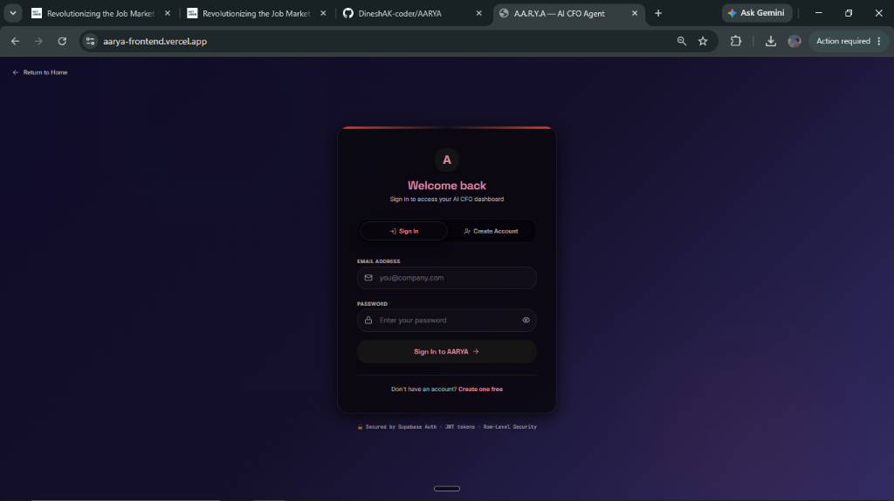
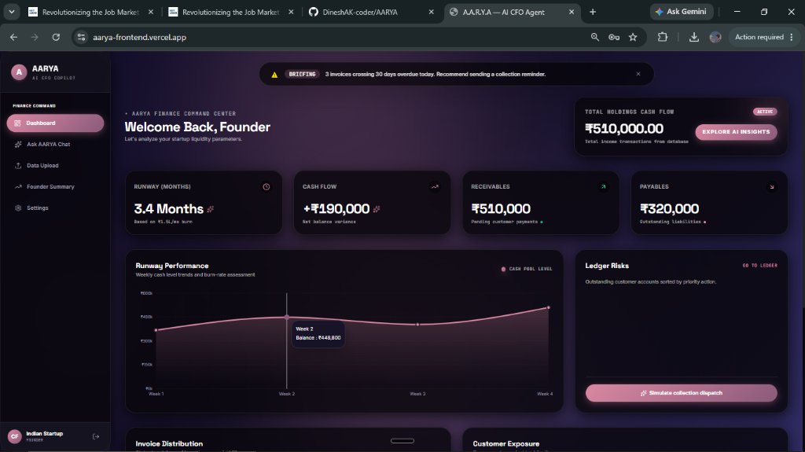
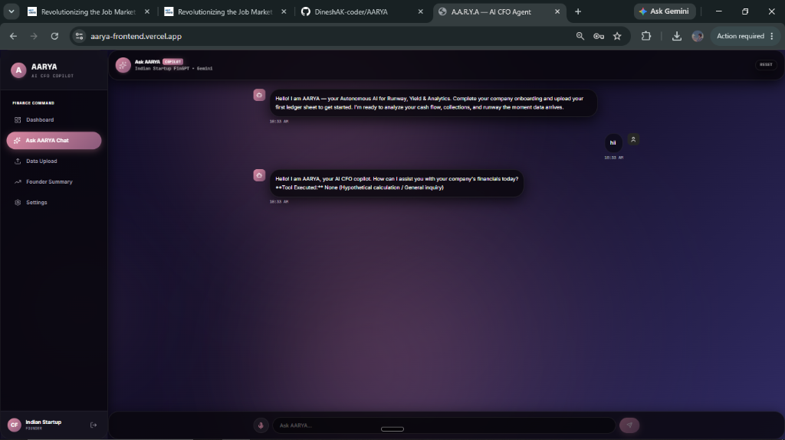
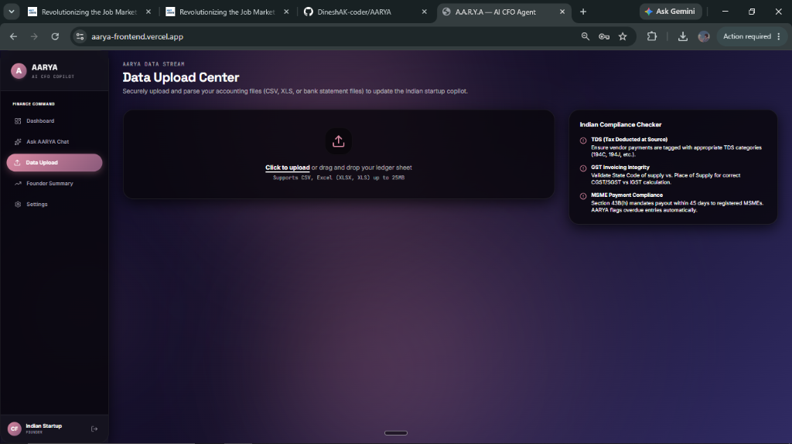
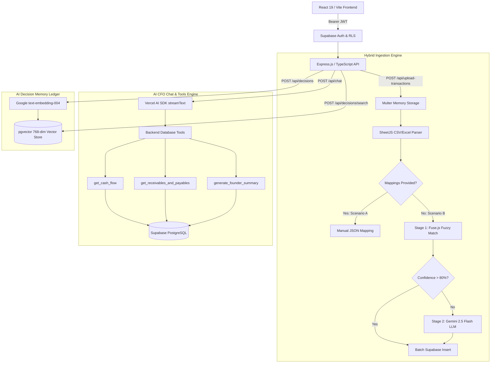

# AARYA — Autonomous AI for Runway, Yield & Analytics 🚀

<div align="center">

**India-First AI CFO Copilot for SMEs and Startups**

### 🌐 [**👉 Experience Live Demo on Vercel 👈**](https://aarya-frontend.vercel.app/) 🚀

[](https://aarya-frontend.vercel.app/)
[](https://www.typescriptlang.org/)
[](https://react.dev/)
[](https://nodejs.org/)
[](https://expressjs.com/)
[](https://supabase.com/)
[](https://www.postgresql.org/)
[](https://ai.google.dev/)
[](https://github.com/pgvector/pgvector)
[](https://vite.dev/)
[](https://tailwindcss.com/)
[](LICENSE)

---

> *"AARYA is an India-first AI CFO copilot for SMEs and startups that turns raw finance data into runway, yield, cash-flow, and decision insights in plain English."*

</div>

---

## 📖 1. Executive Summary

AARYA (**A**utonomous **A**I for **R**unway, **Y**ield & **A**nalytics) is an India-first AI CFO copilot designed for SMEs, startups, finance teams, and Chartered Accountants (CAs). It transforms messy financial data — such as spreadsheets, bank exports, and scattered invoices — into simple, actionable answers about cash flow, runway, dues, and overall business health.

Built as a high-impact 36-hour hackathon MVP, AARYA is architected from day one to scale into an enterprise-grade SaaS financial operating system. It is a fully decoupled full-stack application combining a **React 19 / Vite 6** frontend, a **Node.js + Express.js + TypeScript** backend, **Supabase (PostgreSQL 15+)** as the managed database, and **Google Gemini 2.5 Flash** as the AI engine.

---

## 📸 2. Screenshots

> *Live from [aarya-frontend.vercel.app](https://aarya-frontend.vercel.app/)*

### 🌐 Landing Page — India-first AI CFO Copilot Hero


---

### 🔐 Authentication — Sign In / Create Account


---

### 📊 Executive Dashboard — Finance Command Center


---

### 💬 AI CFO Chat — Ask AARYA (Powered by Gemini 2.5 Flash)


---

### 📤 Data Upload Center — Hybrid CSV/Excel Ingestion


---

## 🚨 3. Problem Statement & Why It Matters

### The Problem
Indian SMEs and startups often manage their finances through disconnected spreadsheets, scattered PDF invoices, bank statements, and manual follow-ups. Founders do not get immediate answers to practical, mission-critical questions such as:
* *"How many months of cash runway do we have left at our current burn rate?"*
* *"Which clients owe us money, and what are our immediate vendor payables?"*
* *"Can we safely afford to hire two new engineers next month?"*

While transaction data exists in abundance, **decision-ready operational insight does not**. Traditional accounting software merely records historical transactions, while generic dashboards display static numbers without executive context. Hiring full-time CFOs or human-led virtual CFO services remains expensive, slow, and dependent on manual interpretation.

### Why This Problem Matters in India
The Indian market exhibits strong willingness to pay for virtual CFO services, finance automation, and real-time cash visibility tools. The operational pain is particularly acute in India because businesses operate within unique regulatory and financial workflows — relying heavily on **GST (Goods & Services Tax)**, **TDS (Tax Deducted at Source)**, **UPI payments**, **bank transfers**, and legacy accounting software that requires human interpretation. This makes finance automation one of the strongest and most resilient SaaS wedges for an India-first startup.

---

## 🎯 4. Target Audience & Positioning

### Primary Users
* **Startup Founders & Co-founders**: Seeking immediate runway calculations, burn rate analysis, and hiring feasibility without waiting for month-end accounting reports.
* **SME Business Owners**: Wanting real-time cash visibility, vendor payable tracking, and customer due collections.

### Secondary Users
* **Finance Managers & Internal Accountants**: Looking to automate ledger ingestion and reporting workflows.
* **Chartered Accountants (CAs) & Fractional CFOs**: Managing multiple client portfolios and requiring an automated financial decision engine.

### Ideal First Customer
A growing Indian small business or seed-stage startup that already generates regular transaction data (CSV/Excel bank exports or invoice ledgers) but currently lacks real-time financial visibility and strategic cash forecasting.

---

## 💡 5. Product Vision & Differentiation

AARYA is designed to feel like an **intelligent financial decision engine**, not just a generic chatbot. The long-term vision is to become the **finance command center** that ingests business data, interprets financial health in plain English, and proactively recommends growth and survival actions.

| Feature | Generic Accounting Software | Generic AI Chatbots | **AARYA (AI CFO Copilot)** |
| :--- | :--- | :--- | :--- |
| **Data Handling** | Records raw transactions | Hallucinates without context | **Interprets ledgers via hybrid AI schema mapping** |
| **Dashboards** | Displays static numbers | No graphical dashboards | **Interactive charts with CFO context & warnings** |
| **Explainability** | Manual formula auditing | Black-box LLM text | **Full mathematical explainability & transaction citations** |
| **Availability** | Requires human operator | General purpose | **Faster, cheaper, 24/7 specialized India-first finance brain** |
| **Local Context** | Global generic formats | Lacks regional nuances | **Built for Indian workflows (GST, TDS, UPI, INR formatting)** |

---

## ⚡ 6. Core MVP Features & Application Screens

The hackathon MVP is small, highly visible, and demo-ready — proving that AARYA can turn raw financial spreadsheets into decision-support insights within minutes.

### 🌟 MVP Screens & Feature Set

| Screen | Route | Key Capabilities |
| :--- | :--- | :--- |
| **Landing Page** | `landing` | Sleek hero, CTA, feature highlights |
| **Auth (Login/Signup)** | `auth` | Supabase email/password auth with JWT session management |
| **Company Onboarding** | `onboarding` | Company name, industry, starting balance, currency (INR ₹ default) |
| **Executive Dashboard** | `dashboard` | Net cash flow, runway months, receivables/payables snapshot, Recharts visualizations |
| **Hybrid Upload** | `upload` | Multi-format CSV/Excel uploader with auto column detection (Fuse.js + Gemini) |
| **AI CFO Chat** | `chat` | Streaming plain-English Q&A powered by Gemini 2.5 Flash + live DB tools |
| **Founder Summary** | `founder` | Automated intelligence brief: what's good, what's risky, what needs attention |
| **Ledger View** | `ledger` | Customer & vendor ledger management with overdue tracking |
| **Billing / Invoices** | `billing` | Invoice creation, status tracking (Paid / Pending / Overdue) |
| **Revenue Intelligence** | `intelligence` | Revenue trend charts and insights |
| **Audit Trail** | `audit` | Full timestamped log of every application action |
| **Settings** | `settings` | Business metadata, profile, logout |

---

## 🏗️ 7. System Architecture & Data Flow

AARYA operates as a decoupled full-stack application leveraging strict multi-tenancy, AI vector embeddings, and real-time database tools:



### Key Architectural Innovations

#### 1. Multi-Tenant PostgreSQL with Strict Row Level Security (RLS)
Every company is isolated at the database level using Supabase RLS. All queries automatically bind to `auth.uid()` via the custom helper function `get_my_company_id()`, guaranteeing zero cross-company data leakage. The backend service-role key bypasses RLS only for bulk inserts, and is never exposed to the client.

#### 2. Hybrid Two-Stage Data Ingestion Pipeline
When messy accounting exports are uploaded without column mappings, AARYA executes a two-stage detection pipeline:
- **Stage 1 — Fuse.js Fuzzy Matching (zero API cost)**: Normalises headers (strips separators, lowercases) and checks against a curated synonym map covering 60+ financial terms across 4 canonical fields. Uses a fuzzy threshold of `0.35`.
- **Stage 2 — Gemini 2.5 Flash LLM Fallback**: If any required field (`amount`, `transaction_type`, `due_date`) cannot be mapped confidently, AARYA samples 5 rows and invokes Gemini 2.5 Flash in structured JSON mode (`responseMimeType: 'application/json'`, `temperature: 0`) to dynamically classify headers into the canonical schema.

#### 3. Tool-First AI Math Explainability (Anti-Hallucination)
To eliminate LLM hallucination in financial calculations, AARYA's chat controller enforces backend tool execution *before* generating any natural language response. The three live database tools return exact mathematical formulas (`calculation_explanation`) and top supporting transaction records (`supporting_transactions`), giving founders complete transparency into how numbers were derived. The Vercel AI SDK `streamText` with `stopWhen: stepCountIs(5)` limits runaway tool loops.

#### 4. Semantic AI Decision Memory (pgvector)
AARYA remembers context and learns from founder actions. It logs financial dilemmas, generates 768-dimensional embeddings using Google's `text-embedding-004`, and uses IVFFlat indexing in PostgreSQL (`lists = 100`) to perform cosine similarity searches — retrieving historical precedents when founders face similar strategic decisions.

---

## 🗂️ 8. Repository Structure

```
AARYA/
├── start.ps1                          # 🚀 Windows PowerShell full-stack launcher
├── README.md
│
├── BACKEND/
│   └── aarya-backend/
│       ├── src/
│       │   ├── app.ts                 # Express app factory (middleware, routes)
│       │   ├── server.ts              # HTTP server bootstrap
│       │   ├── config/
│       │   │   └── supabase.ts        # Supabase admin & anon client config
│       │   ├── middleware/
│       │   │   └── error.middleware.ts # Global error handler + AppError class
│       │   ├── modules/
│       │   │   ├── auth/              # GET /api/auth/me
│       │   │   ├── chat/              # POST /api/chat (streaming Gemini tools)
│       │   │   ├── companies/         # CRUD for company tenants + member invite
│       │   │   ├── decisions/         # AI decision memory CRUD + semantic search
│       │   │   ├── snapshots/         # Financial state snapshot management
│       │   │   └── transactions/      # Hybrid ingestion + paginated listing
│       │   ├── services/
│       │   │   └── aiTools.ts         # get_cash_flow | get_receivables_and_payables | generate_founder_summary
│       │   ├── types/
│       │   │   └── index.ts           # Shared TypeScript type definitions
│       │   └── utils/
│       │       ├── columnMapper.ts    # Fuse.js fuzzy match + row transform helpers
│       │       ├── csvParser.ts       # SheetJS CSV/XLS/XLSX buffer parser
│       │       └── llmClassifier.ts   # Gemini LLM column classifier + embedding generator
│       ├── migrations/
│       │   └── 001_initial_schema.sql # Full DB schema, indexes, RLS, functions, triggers
│       ├── .env.example
│       ├── package.json
│       ├── tsconfig.json
│       ├── tsup.config.ts
│       └── vercel.json
│
└── FRONTEND/
    ├── src/
    │   ├── main.tsx                   # React entry point
    │   ├── App.tsx                    # Root component: session management, view routing
    │   ├── types.ts                   # Shared TypeScript interfaces (BusinessState, ViewType, etc.)
    │   ├── mockData.ts                # Initial demo business state seed
    │   ├── index.css                  # Global Tailwind CSS v4 styles + custom animations
    │   ├── components/
    │   │   ├── Navigation.tsx         # Sidebar (desktop) + BottomNav (mobile)
    │   │   ├── LandingView.tsx        # Public marketing landing page
    │   │   ├── AuthView.tsx           # Sign-in / Sign-up with Supabase Auth
    │   │   ├── OnboardingView.tsx     # Company setup wizard (POST /api/companies/onboard)
    │   │   ├── DashboardView.tsx      # Executive dashboard with Recharts + Motion animations
    │   │   ├── CfoChatView.tsx        # AI CFO chat (useChat hook, voice input, tool transparency)
    │   │   ├── UploadView.tsx         # Hybrid file uploader (drag & drop, column mapping UI)
    │   │   ├── FounderSummaryView.tsx # Automated founder intelligence brief
    │   │   ├── LedgerView.tsx         # Customer/vendor ledger with overdue tracking
    │   │   ├── BillingView.tsx        # Invoice management (Paid / Pending / Overdue)
    │   │   ├── RevenueIntelView.tsx   # Revenue analytics and trend visualization
    │   │   ├── AuditTrailView.tsx     # Timestamped application activity log
    │   │   └── SettingsView.tsx       # Business profile and account settings
    │   └── services/
    │       └── apiClient.ts           # Centralized fetch wrapper with auto JWT attachment
    ├── index.html
    ├── server.ts                      # Vite-compatible Express dev/prod server
    ├── vite.config.ts                 # Vite config with Tailwind plugin + /api proxy
    ├── .env.example
    ├── package.json
    ├── tsconfig.json
    └── vercel.json
```

---

## 🛠️ 9. Technology Stack

| Layer | Technology | Version | Purpose |
| :--- | :--- | :--- | :--- |
| **Frontend Framework** | [React](https://react.dev/) | `^19.0.1` | High-performance SPA with modern hooks and component architecture |
| **Build Tool** | [Vite](https://vite.dev/) | `^6.2.3` | Lightning-fast HMR dev server with `/api` proxy to backend |
| **Styling** | [Tailwind CSS](https://tailwindcss.com/) | `^4.1.14` | Glassmorphic UI, dark mode, responsive layouts |
| **Icons** | [Lucide React](https://lucide.dev/) | `^0.546.0` | Curated financial iconography |
| **Charts** | [Recharts](https://recharts.org/) | `^3.9.1` | Interactive financial charts and runway projections |
| **Animations** | [Motion](https://motion.dev/) | `^12.23.24` | Smooth micro-animations and transitions |
| **Backend Runtime** | [Node.js](https://nodejs.org/) | `>=18.0.0` | Server-side JavaScript runtime |
| **Backend Framework** | [Express.js](https://expressjs.com/) | `^4.21.1` | REST API routing, middleware, TypeScript |
| **Database & Auth** | [Supabase](https://supabase.com/) (PostgreSQL 15+) | `^2.45.4` | Managed Postgres, strict RLS, JWT authentication |
| **AI Chat & Tools** | [Google Gemini 2.5 Flash](https://ai.google.dev/) | via `@ai-sdk/google ^4.0.8` | Streaming chat, tool execution, structured JSON output |
| **AI Embeddings** | Google `text-embedding-004` | via `@google/generative-ai ^0.21.0` | 768-dimensional semantic embeddings for decision memory |
| **AI SDK** | [Vercel AI SDK](https://sdk.vercel.ai/) | `^7.0.15` | `streamText`, `toUIMessageStream`, `useChat`, tool orchestration |
| **Vector Search** | [pgvector](https://github.com/pgvector/pgvector) | (PostgreSQL extension) | IVFFlat cosine similarity search on 768-dim embeddings |
| **File Processing** | [SheetJS (`xlsx`)](https://sheetjs.com/) | `^0.18.5` | In-memory CSV, XLS, XLSX parsing |
| **File Upload** | [Multer](https://github.com/expressjs/multer) | `^2.2.0` | Multipart/form-data handler with memory storage |
| **Fuzzy Matching** | [Fuse.js](https://www.fusejs.io/) | `^7.0.0` | Zero-cost header fuzzy matching for column detection |
| **Validation** | [Zod](https://zod.dev/) | `^3.23.8` | Runtime type validation for all API request bodies |
| **Security** | [Helmet](https://helmetjs.github.io/) | `^8.0.0` | HTTP security headers |
| **Logging** | [Morgan](https://github.com/expressjs/morgan) | `^1.10.0` | HTTP request logging (`dev` in development, `combined` in production) |
| **TypeScript** | [TypeScript](https://www.typescriptlang.org/) | `^5.6.3` / `~5.8.2` | End-to-end type safety |
| **Deployment** | [Vercel](https://vercel.com/) | — | Both backend (`@vercel/node`) and frontend deployed on Vercel |

---

## 🗄️ 10. Database Schema

The entire schema is in [`BACKEND/aarya-backend/migrations/001_initial_schema.sql`](BACKEND/aarya-backend/migrations/001_initial_schema.sql). Run this file once in the Supabase SQL Editor to provision the full database.

### Tables

```mermaid
erDiagram
    companies {
        UUID id PK
        TEXT name
        subscription_status_enum subscription_status
        TIMESTAMPTZ created_at
    }
    users {
        UUID id PK_FK
        UUID company_id FK
        user_role_enum role
        TIMESTAMPTZ created_at
    }
    financial_transactions {
        UUID id PK
        UUID company_id FK
        NUMERIC amount
        transaction_type_enum transaction_type
        DATE due_date
        TEXT description
        TIMESTAMPTZ created_at
    }
    financial_state_snapshots {
        UUID id PK
        UUID company_id FK
        NUMERIC runway_months
        NUMERIC net_cash_flow
        DATE snapshot_date
        TIMESTAMPTZ created_at
    }
    decision_memory_logs {
        UUID id PK
        UUID company_id FK
        TEXT context
        TEXT ai_recommendation
        TEXT founder_decision
        vector_768 embedding
        TIMESTAMPTZ created_at
    }

    companies ||--o{ users : "has many"
    companies ||--o{ financial_transactions : "owns"
    companies ||--o{ financial_state_snapshots : "snapshots"
    companies ||--o{ decision_memory_logs : "remembers"
```

### Enums

| Enum | Values |
| :--- | :--- |
| `subscription_status_enum` | `free`, `pro`, `enterprise` |
| `user_role_enum` | `owner`, `admin`, `viewer` |
| `transaction_type_enum` | `income`, `expense`, `transfer` |

### Database Functions & Triggers

| Function / Trigger | Type | Purpose |
| :--- | :--- | :--- |
| `get_my_company_id()` | SQL Function | Returns `company_id` of the currently authenticated user. Used inside all RLS policies to avoid per-row sub-query repetition. `SECURITY DEFINER` with locked `search_path`. |
| `create_company_and_owner(p_company_name, p_user_id)` | PL/pgSQL Function | Atomically creates a new company tenant and registers the caller as `owner`. Called by the backend onboarding flow using the service-role key. |
| `match_decisions(embedding, threshold, count, company_id)` | SQL Function | Cosine similarity search over `decision_memory_logs` using `<=>` distance operator. Returns rows above `p_match_threshold` similarity, ordered by relevance. |
| `handle_invited_user()` / `on_auth_user_created` | Trigger | Auto-creates a `public.users` row when an invited user accepts a Supabase Auth invite, reading `company_id` and `role` from invite metadata. |

### Row Level Security (RLS) Policies

All five tables have RLS enabled. Authenticated users can **only** access rows where `company_id` matches their own company via `get_my_company_id()`:

| Table | SELECT | INSERT | UPDATE | DELETE |
| :--- | :---: | :---: | :---: | :---: |
| `companies` | own company | — | `owner` only | — |
| `users` | same company | — | own row only | — |
| `financial_transactions` | same company | same company | `admin`+ | `admin`+ |
| `financial_state_snapshots` | same company | `admin`+ | `admin`+ | `admin`+ |
| `decision_memory_logs` | same company | same company | same company | same company |

### Database Indexes

| Index | Table | Purpose |
| :--- | :--- | :--- |
| `idx_users_company_id` | `users` | FK traversal speed |
| `idx_ft_company_id` | `financial_transactions` | Per-company queries |
| `idx_ft_due_date` | `financial_transactions` | Date-range filtering |
| `idx_ft_type` | `financial_transactions` | Transaction-type filtering |
| `idx_fss_company_id` | `financial_state_snapshots` | Snapshot retrieval |
| `idx_fss_snapshot_date` | `financial_state_snapshots` | Date-ordered snapshots |
| `idx_dml_company_id` | `decision_memory_logs` | Decision log retrieval |
| `idx_dml_embedding_ivfflat` | `decision_memory_logs` | ANN cosine similarity (`ivfflat`, `lists=100`) |

---

## 🤖 11. AI Tools — Backend Database Engine

The `getTools(companyId)` factory in [`src/services/aiTools.ts`](BACKEND/aarya-backend/src/services/aiTools.ts) exposes three Vercel AI SDK tools that execute against the live Supabase database. The Gemini model invokes these automatically based on the user's natural language question.

### Tool: `get_cash_flow`
**Trigger**: Any question about cash flow, burn rate, runway, income, or expenses.

Returns the following by querying `financial_transactions` filtered by `company_id`:

| Field | Description |
| :--- | :--- |
| `total_cash_in` | Sum of all `income` transactions |
| `total_cash_out` | Sum of all `expense` transactions |
| `net_cash_flow` | `cash_in - cash_out` |
| `derived_monthly_burn_rate` | Automatically derived from expense date span (`cashOut / monthsSpan`) — the model **never asks the user to provide burn rate manually** |
| `runway_months` | `netCashFlow / derivedBurnRate` (or `999+` if burn rate is zero) |
| `calculation_explanation` | Step-by-step formula string in plain English with INR formatting |
| `supporting_transactions` | Top 15 recent transactions (id, date, type, amount, description) |
| `_execution_meta` | Tool name, executed_at, duration_ms, records_analyzed, status |

### Tool: `get_receivables_and_payables`
**Trigger**: Questions about who owes money, outstanding bills, overdue invoices.

Returns:

| Field | Description |
| :--- | :--- |
| `receivables[]` | All `income` transactions with `is_overdue` flag (due_date < now) |
| `payables[]` | All `expense` transactions with `is_overdue` flag |
| `total_receivables` | Sum of all receivable amounts |
| `total_payables` | Sum of all payable amounts |

### Tool: `generate_founder_summary`
**Trigger**: Questions about overall business health, what's good/risky, strategic recommendations.

Performs a full aggregation pass and returns structured CFO intelligence:

| Field | Description |
| :--- | :--- |
| `what_is_good[]` | Positive highlights (e.g. net-positive operations, surplus) |
| `what_is_risky[]` | Risk flags (e.g. negative cash flow, overdue payables) |
| `what_needs_attention[]` | Urgent items (e.g. overdue receivables) |
| `recommendations[]` | Actionable strategic CFO recommendations with specific INR figures |
| `summary_stats` | `total_income`, `total_expense`, `net_position`, `overdue_receivables`, `overdue_payables` |

**Chat System Prompt Rules** (enforced by `chat.controller.ts`):
1. Always call tools *before* generating any financial answer — never hallucinate metrics.
2. Never ask the user to provide their burn rate — `get_cash_flow` derives it automatically.
3. For hypothetical/sample figures provided by the user, skip tool calls and analyse directly.
4. Always include a `**Tool Executed:** <name> (analyzed N records in Xms)` transparency footer.
5. Maximum 5 tool steps per request (`stopWhen: stepCountIs(5)`).

---

## 🔁 12. Hybrid Ingestion Pipeline — Deep Dive

The hybrid ingestion pipeline in [`src/modules/transactions/`](BACKEND/aarya-backend/src/modules/transactions/) and [`src/utils/`](BACKEND/aarya-backend/src/utils/) handles arbitrary CSV/XLS/XLSX accounting exports.

```mermaid
flowchart LR
    A[Upload File<br/>CSV / XLS / XLSX] --> B[SheetJS Parser<br/>csvParser.ts]
    B --> C{Manual<br/>mappings?}
    C -- Yes --> D[Validate mapping<br/>against headers]
    C -- No --> E[Stage 1: Fuse.js<br/>Fuzzy Match<br/>threshold = 0.35]
    E --> F{All required<br/>fields matched?}
    F -- Yes --> G[source = fuzzy]
    F -- No --> H[Stage 2: Gemini 2.5 Flash<br/>JSON mode, temp=0<br/>5 sample rows]
    H --> I[Validate LLM header names<br/>against file headers]
    I --> J[source = llm]
    D --> K[Transform Rows]
    G --> K
    J --> K
    K --> L[Parse amounts<br/>Strip ₹ £ $ € symbols<br/>Preserve sign for type inference]
    L --> M[Normalise transaction_type<br/>income/expense/transfer<br/>from 15+ synonyms each]
    M --> N[Parse dates<br/>ISO, DD/MM/YYYY, etc.]
    N --> O[Batch INSERT<br/>500 rows per batch<br/>Supabase Admin]
    O --> P[Return IngestionResult<br/>inserted, errors, source, mappings]
```



**Supported Date Formats**: ISO `YYYY-MM-DD`, `DD/MM/YYYY`, `MM/DD/YYYY`, `DD-MM-YYYY`, and any format parseable by JavaScript's `Date` constructor.

**Supported Amount Formats**: Currency symbols (₹ £ $ € ¥), thousands separators (commas), negative amounts (sign inferred for `transaction_type` when no type column exists).

**Transaction Type Synonyms**:
- `income`: `income`, `revenue`, `credit`, `inflow`, `receipt`, `sales`, `gain`, `receivable`, `cr`
- `expense`: `expense`, `debit`, `outflow`, `payment`, `cost`, `spend`, `loss`, `outgoing`, `payable`, `dr`
- `transfer`: `transfer`, `move`, `shift`, `between`

---

## 🚀 13. Step-by-Step Setup & Full-Stack Launcher

You can launch both the backend API and frontend application simultaneously on Windows using the automated PowerShell boot script, or set them up manually.

### Prerequisites
* **Node.js**: `v18.0.0` or higher — [Download Node.js](https://nodejs.org/)
* **Supabase Account**: Free tier works perfectly — [Sign up at Supabase](https://supabase.com/)
* **Google Gemini API Key**: Free tier available — [Get key at Google AI Studio](https://aistudio.google.com/app/apikey)

---

### Step 1: Clone the Repository & Install Dependencies

```bash
# Clone the project repository
git clone https://github.com/DineshAK-coder/AARYA.git
cd AARYA

# Install backend dependencies
cd BACKEND/aarya-backend
npm install

# Install frontend dependencies
cd ../../FRONTEND
npm install
cd ..
```

---

### Step 2: Supabase Database Setup

1. **Create a New Project**: In your [Supabase Dashboard](https://app.supabase.com), click **New Project**, select a region, set a database password, and wait ~2 minutes for provisioning.

2. **Enable pgvector**:
   - Navigate to **Database → Extensions** in the left sidebar.
   - Search for `vector` and toggle it **ON**.

3. **Run the SQL Migration**:
   - Go to **SQL Editor** and click **New query**.
   - Open [`BACKEND/aarya-backend/migrations/001_initial_schema.sql`](BACKEND/aarya-backend/migrations/001_initial_schema.sql), copy the entire SQL contents, paste into the query editor, and click **Run** (▶).
   - *Verification*: Navigate to **Authentication → Policies** to confirm active RLS policies on all five tables.

---

### Step 3: Configure Environment Variables

#### Backend Environment (`BACKEND/aarya-backend/.env`)

Copy `.env.example` to `.env` inside `BACKEND/aarya-backend/`:

```env
# ============================================================
# AARYA Backend – Environment Variables
# ============================================================

# ---- Supabase (Project Settings → API) ----
SUPABASE_URL=https://your-project-ref.supabase.co
SUPABASE_ANON_KEY=eyJhbGciOiJIUzI1NiIsIn...
# WARNING: service_role key bypasses ALL RLS. Server-side only!
SUPABASE_SERVICE_ROLE_KEY=eyJhbGciOiJIUzI1NiIsIn...

# ---- Google Gemini AI (https://aistudio.google.com/app/apikey) ----
GEMINI_API_KEY=AIzaSy...

# ---- Server ----
PORT=3001
NODE_ENV=development

# ---- File Upload ----
MAX_FILE_SIZE_MB=10
```

#### Frontend Environment (`FRONTEND/.env`)

Copy `.env.example` to `.env` inside `FRONTEND/`. You also need Supabase credentials for the browser client:

```env
# Supabase browser client (public anon key only — never the service role key)
VITE_SUPABASE_URL=https://your-project-ref.supabase.co
VITE_SUPABASE_ANON_KEY=eyJhbGciOiJIUzI1NiIsIn...

# Backend API base URL (leave empty for dev — Vite proxy handles /api/*)
VITE_API_BASE_URL=

# Gemini API key (for any client-side AI features)
GEMINI_API_KEY=AIzaSy...

# App URL (used for OAuth callbacks, self-referential links)
APP_URL=http://localhost:5173
```

---

### Step 4: Launch Full-Stack Application

#### Option A — Automated (Recommended for Windows)

From the repository root, run the PowerShell boot script:

```powershell
.\start.ps1
```

This opens two separate PowerShell terminal windows and launches:
- **Backend API Server** → `http://localhost:3001` (with `tsx watch` hot-reloading)
- **Frontend Web App** → `http://localhost:5173` (with Vite HMR)

Then open **[http://localhost:5173](http://localhost:5173)** in your browser.

#### Option B — Manual

```bash
# Terminal 1 – Backend
cd BACKEND/aarya-backend
npm run dev

# Terminal 2 – Frontend
cd FRONTEND
npm run dev
```

#### Available npm Scripts

**Backend** (`BACKEND/aarya-backend/`):

| Script | Command | Description |
| :--- | :--- | :--- |
| `dev` | `tsx watch src/server.ts` | Development server with hot-reload |
| `build` | `tsup src/server.ts --format esm --dts --out-dir dist` | Production ESM build |
| `start` | `node dist/server.js` | Run production build |
| `lint` | `tsc --noEmit` | TypeScript type-check only |

**Frontend** (`FRONTEND/`):

| Script | Command | Description |
| :--- | :--- | :--- |
| `dev` | `tsx server.ts` | Vite dev server via Express |
| `build` | `vite build && esbuild server.ts ...` | Production bundle |
| `start` | `node dist/server.cjs` | Run production server |
| `lint` | `tsc --noEmit` | TypeScript type-check only |

---

## 📡 14. Comprehensive API Reference & cURL Examples

All protected API endpoints require a valid Supabase Auth JWT:
```
Authorization: Bearer <your_access_token>
```

### 🌐 System & Health Endpoints

| Method | Endpoint | Description | Auth |
| :---: | :--- | :--- | :---: |
| `GET` | `/health` | Server health check (`status`, `service`, `timestamp`) | ❌ No |
| `GET` | `/api/auth/me` | Current authenticated user profile & company details | ✅ Yes |

```bash
# Health check
curl http://localhost:3001/health
# Response: {"status":"ok","service":"aarya-backend","timestamp":"..."}
```

---

### 🏢 Company & Onboarding Endpoints

| Method | Endpoint | Description | Auth | Role |
| :---: | :--- | :--- | :---: | :---: |
| `POST` | `/api/companies/onboard` | Create new company tenant (atomic — creates company + owner user record) | ✅ | Any |
| `GET` | `/api/companies/me` | Retrieve current company profile & billing tier | ✅ | Any |
| `PATCH` | `/api/companies/me` | Update company name or subscription status | ✅ | `owner` |
| `GET` | `/api/companies/members` | List all team members belonging to the company | ✅ | Any |
| `POST` | `/api/companies/invite` | Invite a new member by email (Supabase Admin invite with metadata) | ✅ | `owner`/`admin` |

```bash
# Onboard a new company
curl -X POST http://localhost:3001/api/companies/onboard \
  -H "Authorization: Bearer <your_token>" \
  -H "Content-Type: application/json" \
  -d '{"name": "Acme Innovations Pvt Ltd"}'
```

---

### 📊 Financial Transactions & Hybrid Ingestion

| Method | Endpoint | Description | Auth |
| :---: | :--- | :--- | :---: |
| `POST` | `/api/upload-transactions` | **Hybrid Ingestion**: Upload CSV/Excel with optional `column_mappings` JSON | ✅ |
| `GET` | `/api/transactions` | List ledger transactions (pagination, date range, type filter) | ✅ |

#### Upload: Scenario A — Manual Mappings (fast path)
```bash
curl -X POST http://localhost:3001/api/upload-transactions \
  -H "Authorization: Bearer <your_token>" \
  -F "file=@/path/to/accounts.csv" \
  -F 'column_mappings={"amount":"Value (INR)","transaction_type":"Flow Category","due_date":"Posting Date","description":"Narrative"}'
```
*Response (`mapping_source: "manual"`)*:
```json
{
  "success": true,
  "data": {
    "inserted": 142,
    "errors": [],
    "mapping_source": "manual"
  }
}
```

#### Upload: Scenario B — Auto-Detection via Fuse.js + Gemini 2.5 Flash
```bash
curl -X POST http://localhost:3001/api/upload-transactions \
  -H "Authorization: Bearer <your_token>" \
  -F "file=@/path/to/messy_accounts.xlsx"
```
*Response (`mapping_source: "llm"` when Gemini was invoked)*:
```json
{
  "success": true,
  "data": {
    "inserted": 142,
    "errors": [],
    "mapping_source": "llm",
    "detected_mappings": {
      "amount": "Value (INR)",
      "transaction_type": "Flow Category",
      "due_date": "Posting Date",
      "description": "Narrative"
    }
  }
}
```

#### List Transactions (with filters)
```bash
# Get income transactions between two dates, paginated
curl "http://localhost:3001/api/transactions?transaction_type=income&from_date=2024-01-01&to_date=2024-12-31&limit=50&offset=0" \
  -H "Authorization: Bearer <your_token>"
```

---

### 💬 AI CFO Chat & Tool Orchestration

| Method | Endpoint | Description | Auth |
| :---: | :--- | :--- | :---: |
| `POST` | `/api/chat` | Vercel AI SDK streaming endpoint — executes live DB tools then streams Gemini response | ✅ |

```bash
curl -X POST http://localhost:3001/api/chat \
  -H "Authorization: Bearer <your_token>" \
  -H "Content-Type: application/json" \
  -d '{
    "messages": [
      {"role": "user", "content": [{"type": "text", "text": "What is our current cash runway?"}]}
    ]
  }'
```
*The endpoint returns a streaming UI message format (Vercel AI SDK protocol). The frontend uses `@ai-sdk/react`'s `useChat` hook to consume it. The response will include tool execution results before the final text.*

**Timeout protection**: The chat controller sets a 35-second `AbortController` timeout. The request is automatically aborted if the combined tool execution + generation time exceeds this limit.

---

### 🧠 AI Decision Memory Ledger (pgvector)

| Method | Endpoint | Description | Auth |
| :---: | :--- | :--- | :---: |
| `GET` | `/api/decisions` | List historical AI decision logs (paginated) | ✅ |
| `POST` | `/api/decisions` | Store financial context + AI recommendation, generates 768-dim embedding | ✅ |
| `POST` | `/api/decisions/search` | **Semantic Search**: Find relevant historical decisions via cosine similarity | ✅ |
| `PATCH` | `/api/decisions/:id` | Log the actual decision taken by the founder (outcome tracking) | ✅ |

```bash
# Store a new decision (triggers text-embedding-004 embedding generation)
curl -X POST http://localhost:3001/api/decisions \
  -H "Authorization: Bearer <your_token>" \
  -H "Content-Type: application/json" \
  -d '{
    "context": "We have 3 months of runway at current burn rate of ₹8L/month",
    "ai_recommendation": "Reduce discretionary spend by 30% and accelerate receivables collection",
    "founder_decision": "Approved — implementing hiring freeze and payment nudges"
  }'

# Semantic similarity search
curl -X POST http://localhost:3001/api/decisions/search \
  -H "Authorization: Bearer <your_token>" \
  -H "Content-Type: application/json" \
  -d '{
    "query": "Should we extend vendor payment cycles to preserve cash?",
    "threshold": 0.4,
    "limit": 5
  }'

# Log what the founder actually decided (for outcome learning)
curl -X PATCH http://localhost:3001/api/decisions/<decision_id> \
  -H "Authorization: Bearer <your_token>" \
  -H "Content-Type: application/json" \
  -d '{"founder_decision": "Extended net-60 terms with 3 vendors. Saved ₹12L in monthly outflows."}'
```

---

### 📸 Financial State Snapshots

| Method | Endpoint | Description | Auth |
| :---: | :--- | :--- | :---: |
| `GET` | `/api/snapshots` | List historical financial state snapshots | ✅ |
| `POST` | `/api/snapshots` | Store a new snapshot (runway, net_cash_flow, snapshot_date) | ✅ |

---

## 🏛️ 15. Frontend Architecture

The frontend is a single-page application built with React 19 and managed through a single root `App.tsx` component that drives all view routing via a `ViewType` state variable.

### Application State Model (`BusinessState`)

```typescript
interface BusinessState {
  businessName: string;       // Company display name
  industry: string;           // Industry category
  currency: string;           // e.g., "INR"
  currencySymbol: string;     // e.g., "₹"
  startingBalance: number;    // Opening balance from onboarding
  ledger: LedgerItem[];       // Customer/vendor ledger entries
  invoices: Invoice[];        // Invoice records (Paid/Pending/Overdue)
  activities: Activity[];     // Audit trail entries
  chatHistory: CfoMessage[];  // CFO chat message history
  onboarded: boolean;         // Whether company setup is complete
  loggedIn: boolean;          // Auth session status (always from Supabase, not localStorage)
  userEmail?: string;
  companyId?: string;         // Backend company UUID
}
```

State is persisted to `localStorage` under key `aarya_business_state`, but `loggedIn` is always reset on mount and re-verified against the live Supabase session to handle JWT expiry correctly.

### Session Management & Routing Logic

```
Page Load
    ↓
supabase.auth.getSession()
    ├─ No session → show "landing"
    └─ Session exists → checkUserProfileAndRoute(user)
            ├─ public.users row exists (company_id found) → show "dashboard"
            └─ No public.users row → show "onboarding" (force company setup)

supabase.auth.onAuthStateChange()
    ├─ SIGNED_IN → checkUserProfileAndRoute()
    └─ SIGNED_OUT → reset state → show "landing"
```

### API Client (`src/services/apiClient.ts`)
The centralized API client automatically:
1. Retrieves the current Supabase JWT via `getSession()` and attaches it as `Authorization: Bearer`.
2. Sets `Content-Type: application/json` for JSON bodies.
3. Intentionally omits `Content-Type` for `FormData` (file uploads) so the browser sets the correct multipart boundary.
4. Uses `VITE_API_BASE_URL` as the base (defaults to `''`, relying on the Vite `/api` proxy during development).

### UI Design System
- **Color Palette**: Deep purple gradient background (`#0f0c29` → `#15112e` → `#302b63`) with rose/mauve glassmorphic accents (`#D988A1`, `#8A5A7B`).
- **Background Effects**: 4 large blurred radial gradient orbs creating a dynamic ambient glow.
- **Always Dark Mode**: `document.documentElement.classList.add("dark")` enforced on mount.
- **Responsive Layout**: Desktop uses a fixed left `Sidebar` + main content panel. Mobile uses a `BottomNav` tab bar.
- **Animations**: Framer Motion (`motion` package) for smooth page transitions and micro-interactions.

---

## 🌐 16. Deployment

Both the backend and frontend are deployed independently on **Vercel**.

### Backend Deployment (`BACKEND/aarya-backend/vercel.json`)
```json
{
  "version": 2,
  "builds": [{ "src": "src/server.ts", "use": "@vercel/node" }],
  "routes": [{ "src": "/(.*)", "dest": "src/server.ts" }]
}
```
Set all environment variables from `BACKEND/aarya-backend/.env.example` in the Vercel project settings.

### Frontend Deployment (`FRONTEND/vercel.json`)
```json
{
  "rewrites": [{ "source": "/(.*)", "destination": "/index.html" }]
}
```
All routes rewrite to `index.html` for SPA client-side routing. Set `VITE_SUPABASE_URL`, `VITE_SUPABASE_ANON_KEY`, and `VITE_API_BASE_URL` (pointing to deployed backend URL) in Vercel environment variables.

**Live deployment**: [https://aarya-frontend.vercel.app/](https://aarya-frontend.vercel.app/)

---

## 🔮 17. Future Roadmap (Post-Hackathon Vision)

As AARYA evolves from a 36-hour hackathon MVP into a comprehensive finance operating system, our long-term roadmap includes:

- [ ] **Native Indian Accounting Integrations**: Direct API synchronization with **Tally Prime**, **Zoho Books**, and **QuickBooks India**.
- [ ] **Automated Bank & UPI Reconciliation**: Direct bank statement parsing, UPI reference matching, and payment gateway (Razorpay / Cashfree) fee auto-reconciliation.
- [ ] **Compliance & Tax Reminders**: Automated alerts and cash runway adjustments for upcoming **GST (GSTR-1, GSTR-3B)**, **TDS**, and advance tax filing deadlines.
- [ ] **Automated Collection Nudges**: Smart, AI-drafted payment reminders sent via **WhatsApp** and email for overdue accounts receivable.
- [ ] **Scenario Planning & Board Decks**: Interactive sensitivity analysis (*"What if customer churn increases by 2%?"*) and one-click PDF generation for investor updates and board presentations.
- [ ] **Multi-Client Portal for CAs**: Dedicated dashboard view allowing Chartered Accountants and fractional CFOs to manage dozens of SME clients seamlessly from a single login.
- [ ] **Mobile App**: React Native companion app for on-the-go financial monitoring and AI chat.
- [ ] **Webhook Integrations**: Real-time bank feed ingestion via webhook APIs for automatic ledger updates.

---

## 💼 18. Business Model

* **SaaS Subscription**: AARYA operates on a tiered SaaS subscription model:
  - **Free**: Basic dashboard, manual CSV upload, limited chat queries
  - **Pro**: Unlimited uploads, full AI chat, decision memory, snapshot history
  - **Enterprise**: Multi-user teams, CA client portal, API access, priority support
* **India-First Positioning**: Starting with the strong Indian SME and startup market (30M+ registered MSMEs) where the pain is most acute and regulatory context (GST, TDS, UPI) creates a natural moat.
* **Final Verdict**: Built to be an indispensable **finance decision copilot** with an India-first wedge — keeping the MVP simple, visible, and immediately useful for founders.

---

## 👥 19. Contributing

Built with ❤️ for Indian founders and SMEs. Open-sourced under the **MIT License**.

### Contribution Workflow
1. **Fork** the repository
2. **Create** your feature branch: `git checkout -b feature/amazing-feature`
3. **Commit** your changes: `git commit -m 'feat: add amazing feature'`
4. **Push** to the branch: `git push origin feature/amazing-feature`
5. **Open** a Pull Request against `main`

### Development Guidelines
- Run `npm run lint` (TypeScript type-check) in both `BACKEND/aarya-backend/` and `FRONTEND/` before opening a PR.
- Backend API changes should include a corresponding migration in `migrations/` if they modify the database schema.
- All new API endpoints must use the `authenticateUser` middleware and scope queries to `req.user.company_id`.
- Frontend components should use the centralized `apiClient.ts` for all backend requests — never use raw `fetch` with hardcoded URLs.

---

## 📄 20. License

Distributed under the **MIT License**. See `LICENSE` for more information.

---

<div align="center">

**AARYA** — The Finance Brain for India's Next Generation of Entrepreneurs.

*Transforming raw financial data into runway, yield, and strategic clarity.*

[Live Demo](https://aarya-frontend.vercel.app/) · [Report Bug](https://github.com/DineshAK-coder/AARYA/issues) · [Request Feature](https://github.com/DineshAK-coder/AARYA/issues)

</div>
